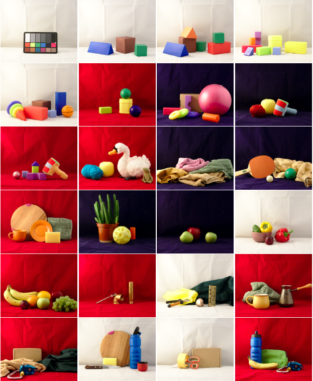
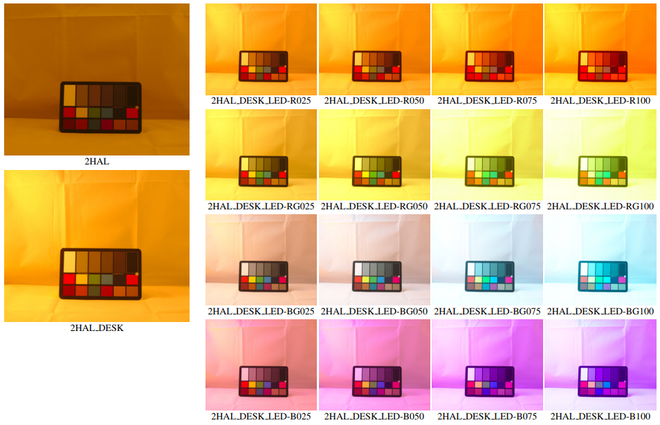

# Multiple Light Source Dataset for Colour Research (work in progress)

+ Images of **24 multiple object scenes**. 
+ **TODO? one scene contains color cheker.
+ Each scene is taken under **18 multiple light source illumination scenarios**, the illuminants are varying in dominant spectral colours, intensity and distance from the scene.
+ **Spectral characteristics** of the camera, illuminants sources and uniformly coloured object surfaces.
+ Pixel-by-pixel masks of uniformly coloured object surfaces for each scene.

We mainly address the realistic scenarios for evaluation of computational colour constancy algorithms, but also have aimed to make the data as general as possible for computational colour science and computer vision. 
Details have been published in: [Multiple Light Source Dataset for Colour Research ]().

If you use this dataset, please, cite the appropriate paper.

    @article{smagina2019multiple,
    title={Multiple Light Source Dataset for Colour Research},
    author={Smagina, Anna and Grigoryev, Anton and Ershov, Egor},
    journal={arXiv preprint},
    year={2019}
    }

## Image data

 

An overview of all 24 recorded MLS scenes is given on the figure above.

Each scene was constructed inside a 60x60x60 cm softbox and illuminated from the outside.
Illumination of each scene is varied in 18 configurations:

 

Each image of the scene is marked with a list of the turned-on light sources, which are ones of the following:

+ 2HAL are two halogen lights, installed at the distance about 1.2 m each; form the lighting close to embient, 
+ DESK is a desktop lamp installed at 20 cm from the softbox, 
+ R025, R050, RG025, BG025 etc is a 3-colored (red, green, blue) LED strip mounted at the top of softbox; the letters R, RG, GB or B indicates turned-on colored components of the LED-lapm, while the numbers 025, 050, 070 and 100 indicates the percentage of the emitting power.

The shooting was performed with the white balance adjusted to 6500K. 
No additional white balance correction was performed during the post-processing of the images.

Each scene is also provided with the pixel-by-pixel colouring annotation given in a 8-bit PNG file, in which
unique pixels colour corresponds to uniform colouring of the scene presented in a spectral data (see section below). 

**TODO:** image post-processing

**Full resolution (2391 x 1900)**

[32-bit tif images](http://vis.iitp.ru/mls-dataset/images_32bit.zip) 15 GB

[masks](http://vis.iitp.ru/mls-dataset/masks_32bit.zip) 3 MB

**Half-resolution (1280 x 1051)**

[16-bit lossless compressed png images](http://vis.iitp.ru/mls-dataset/images_16bit.zip) 2.6 GB

[masks](http://vis.iitp.ru/mls-dataset/masks_16bit.zip) < 1 MB

**Quarter resolution (640 x 525) for preview**

[jpeg images](http://vis.iitp.ru/mls-dataset/images_preview.zip) 160 MB

[masks](http://vis.iitp.ru/mls-dataset/masks_preview.zip) < 1MB

Images files are organized as following:

<pre>
├── 01
│   ├── 01_2HAL_DESK_B025.{tif, png, jpg}
│   ├── 01_2HAL_DESK_B050.{tif, png, jpg}
│   ├── 01_2HAL_DESK_B075.{tif, png, jpg}
│   ├── 01_2HAL_DESK_B100.{tif, png, jpg}
│   ├── ...
│   ├── 01_2HAL_DESK.{tif, png, jpg}
│   └── 01_2HAL.{tif, png, jpg}
├── 02
│   ...
├── 03
│   ...
</pre>

where the subdirectory name and the first number in the file name -- 01, 02, 03 etc -- indicates scene number, while the other part of file name -- 2HAL, 2HAL_DESK, 01_2HAL_DESK_B025 etc -- is a list of turned on illuminants (see description above in this section).  2HAL_DESK_B025 indicates various lighting conditions of a given scene. 

Masks files are named as <*scene_number*>.png.

## Camera spectral sensitivity

**TODO** 

## Spectra

**TODO:** data format description

[illuminants](http://vis.iitp.ru/mls-dataset/illuminants.zip) XX MB

[surfaces](http://vis.iitp.ru/mls-dataset/surfaces.zip) XX MB

The illuminants spectra are provided along with the experimenta setup sheme.
Note, that spectra of red, green and blue light of 3-colored LED strip are additive. **TODO:** complete notes on LED spectra.

**TODO:** how to link surface spectra with the masks? 

## License & citation  

Copyright 2018 Visillect Service LLC
Developed for Kharkevich Institute for Information Transmission Problems of the Russian Academy of Sciences (IITP RAS)

 Licensed under a <a rel="license" href="http://creativecommons.org/licenses/by-sa/4.0/">Creative Commons Attribution-ShareAlike 4.0 International License</a>
